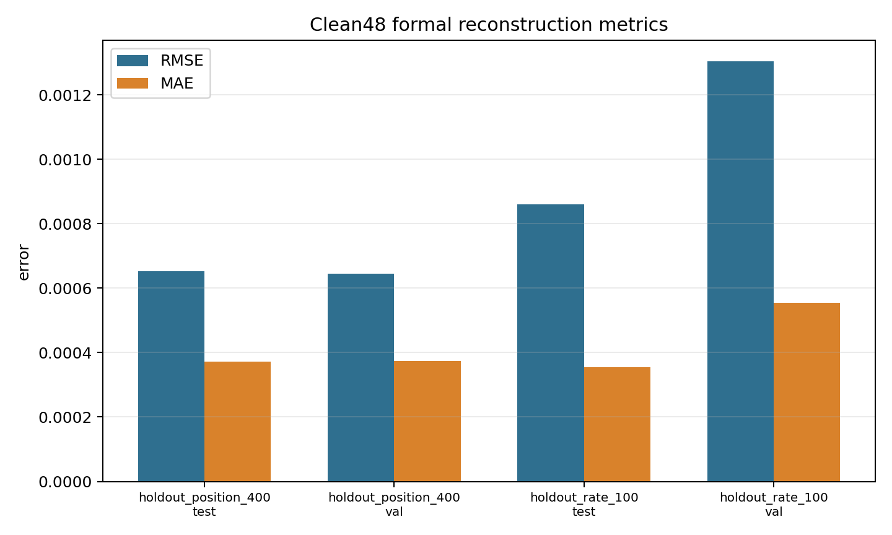
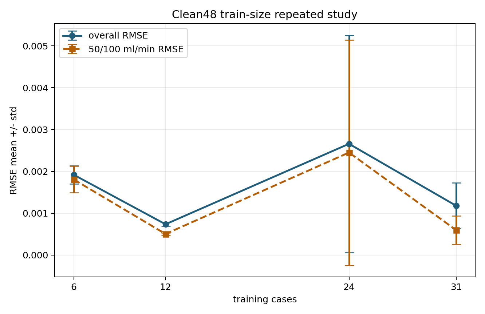

# Clean48 训练结果更新 2026-04-13

## 当前结论

截至 2026-04-13 11:28，`cfd48_clean` 数据上的两个正式闭环验证任务和训练数据量多重复实验均已完成。当前结果可以支持导师要求中的第一部分和第二部分：已经用未参与训练的 CFD 工况抽取传感器输入，再通过模型反演三维浓度场，并回到 CFD 全场真值计算逐点误差指标。

训练数据量曲线已经完成 `6/12/24/31` 四个规模、每个规模 3 次分层重复。最终结果显示精度与训练样本量不是简单线性关系，也不是稳定的边际收益递减，而是呈现受训练稳定性和观测注入机制影响的非单调波动。

## Clean Formal 结果

| 实验 | split | case 数 | RMSE | MAE | 有效羽流区相对 L1 | 质量积分相对误差 |
| --- | --- | ---: | ---: | ---: | ---: | ---: |
| 未见泄漏位置 `(400,0,0)` | val | 7 | 6.439e-4 | 3.734e-4 | 3.521 | 3.894 |
| 未见泄漏位置 `(400,0,0)` | test | 7 | 6.521e-4 | 3.717e-4 | 1.379 | 0.899 |
| 未见泄漏率 `100 mL/min` | val | 7 | 1.304e-3 | 5.546e-4 | 1.862 | 0.739 |
| 未见泄漏率 `100 mL/min` | test | 7 | 8.600e-4 | 3.548e-4 | 2.050 | 0.932 |

这组结果相比旧的 `cfd56` 结果更可靠，因为已经剔除了原始 CFD 浓度列全 1 的 8 个异常 case，并且服务器端质检确认 `flagged_count=0`。汇报时应明确写成：当前正式结果基于 `48` 组 clean CFD 工况，而不是原始候选 `56` 组。

对应图表：

## 训练数据量实验最终结果

当前训练数据量实验采用 `lowflow_focus_v1` 加权策略，训练规模为 `6/12/24/31`，每个规模做 `3` 次分层重复，最终完成 `12/12` 个重复。

| 训练工况数 | 重复次数 | RMSE 均值 | RMSE 标准差 | MAE 均值 | 低泄漏率 RMSE 均值 |
| ---: | ---: | ---: | ---: | ---: | ---: |
| 6 | 3/3 | 1.918e-3 | 2.197e-4 | 1.015e-3 | 1.805e-3 |
| 12 | 3/3 | 7.361e-4 | 4.647e-5 | 4.628e-4 | 5.041e-4 |
| 24 | 3/3 | 2.658e-3 | 2.597e-3 | 1.212e-3 | 2.450e-3 |
| 31 | 3/3 | 1.180e-3 | 5.446e-4 | 5.840e-4 | 5.982e-4 |

最终结果显示训练数据量增加并未带来单调收益。`n=12` 表现最好，`n=24` 出现明显波动，主要由某次重复的异常高误差拉高均值和标准差。这说明当前系统的主要瓶颈不只是训练样本数量，也可能包括模型容量、GPSD 训练预算、低泄漏率样本难度以及 MPDPS 观测注入稳定性。

对应图表：

## 服务器任务状态

当前训练任务已经完成：

| 任务 | 状态 |
| --- | --- |
| clean formal 未见泄漏位置 | 完成 |
| clean formal 未见泄漏率 | 完成 |
| train-size repeated study | `12/12` 完成 |

服务器严格扫描当前正式日志未发现新的 `Traceback`、`FileNotFoundError`、`RuntimeError`、`CUDA out`、`Killed`。旧日志中仍存在此前 `cfd56` 或错误参数传递阶段的 Traceback，这些不属于当前 clean48 正式结果。汇报时不要引用旧 `cfd56` 训练数据量结论，只引用 clean48 formal 结果和 clean48 训练数据量最终结果。

## 汇报建议

明天汇报可以采用以下表述：

本阶段已完成数据质量清洗和 clean 数据集重建。原始 56 组候选 CFD 中有 8 组原始 `molef-h2` 浓度列异常为常数 1，已剔除；正式训练和评估均基于 48 组有效 CFD 工况。基于 clean 数据集，已经完成未见泄漏位置和未见泄漏率两个闭环验证实验：从未训练 CFD 工况抽样传感器数据，输入模型反演三维浓度场，并与 CFD 全场逐点对比。当前未见位置 test RMSE 为 `6.521e-4`，未见泄漏率 test RMSE 为 `8.600e-4`。训练数据量实验完成 `6/12/24/31` 四个规模、每个规模 3 次重复，结果显示精度与训练数据量不是简单线性关系，而呈现非单调波动；当前 `12` 组训练样本平均 RMSE 最低，`24` 组波动最大，后续需要排查高误差重复的具体原因。
