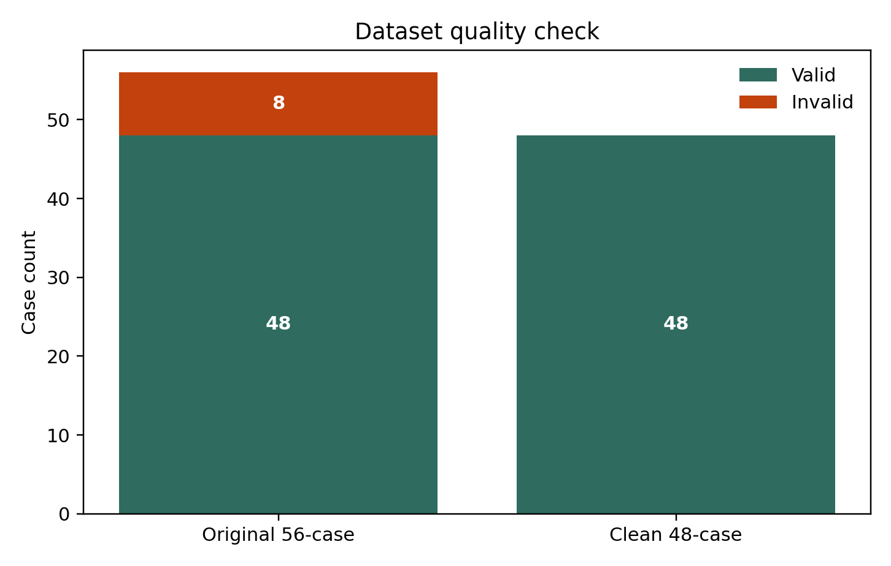
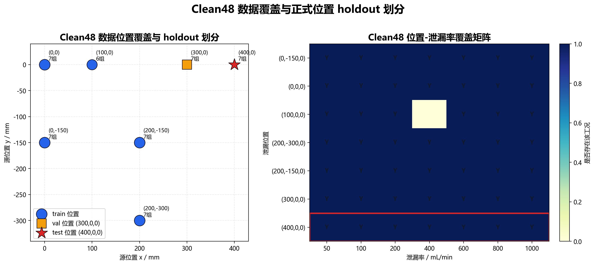
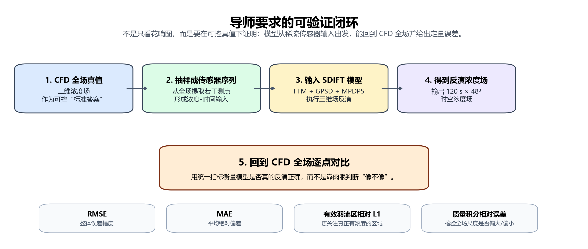
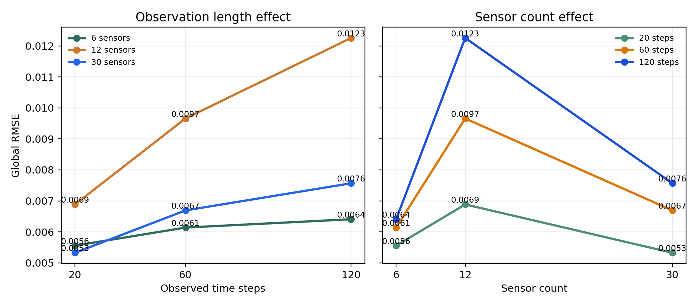
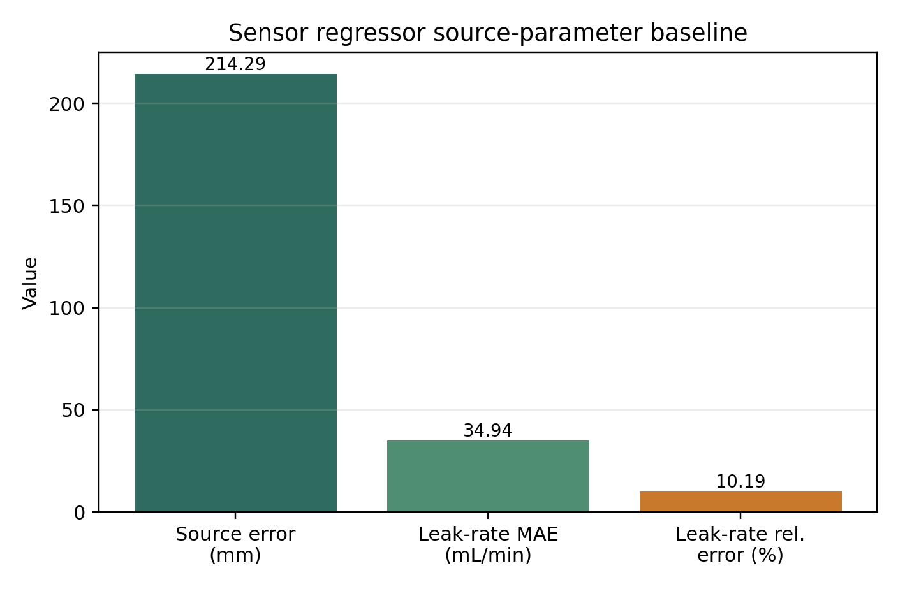
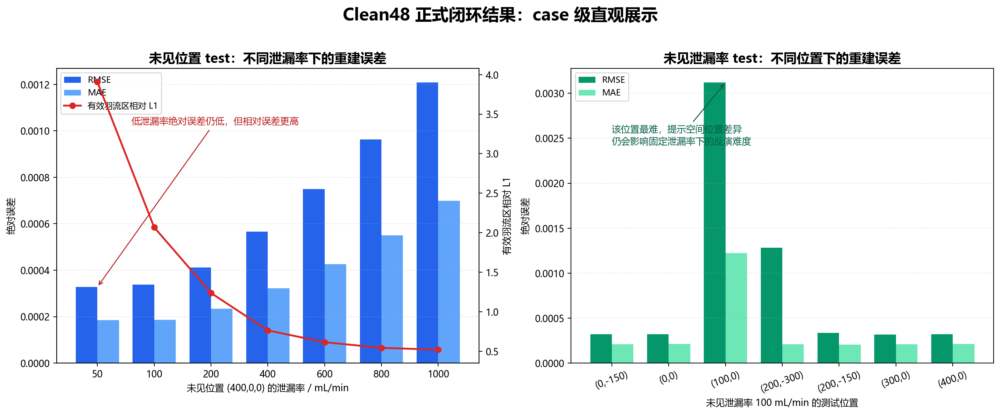
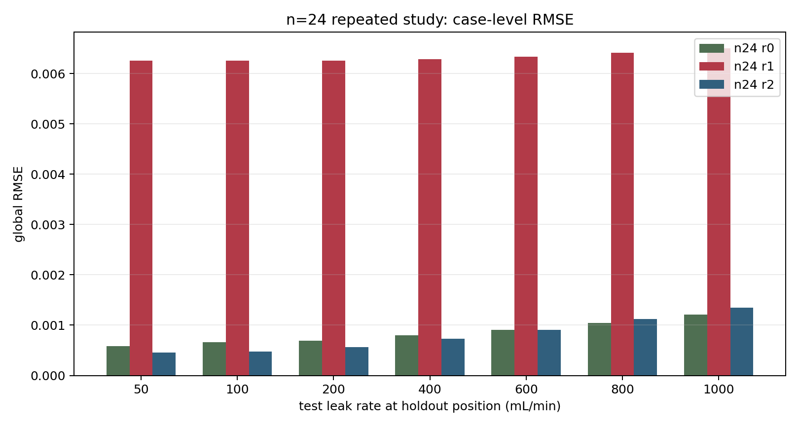
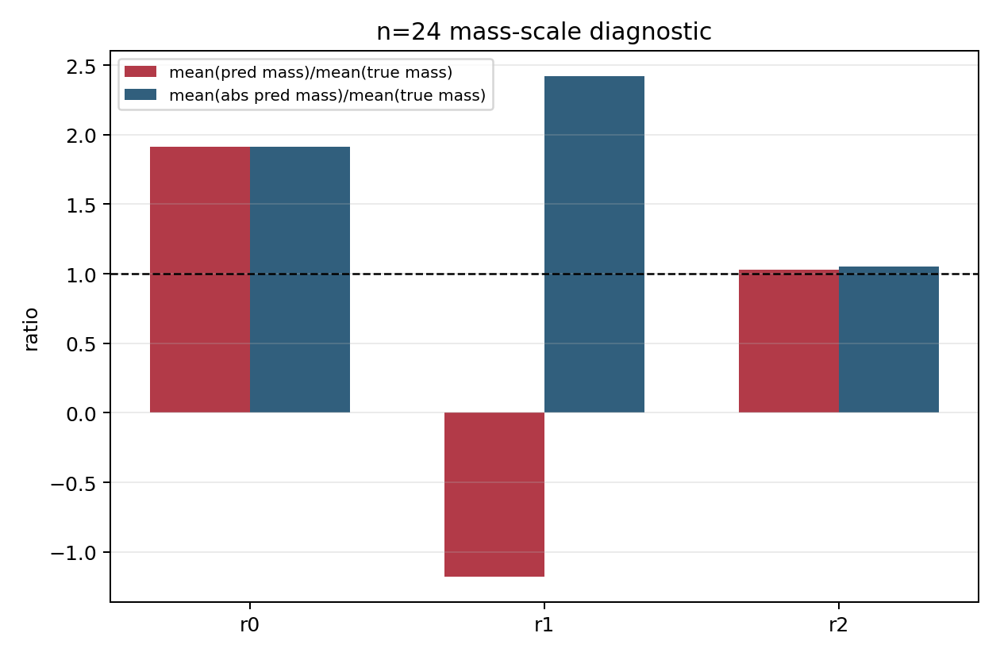
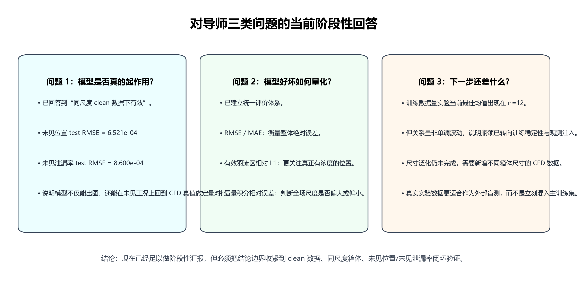

# 基于稀疏测点的受限空间氢气泄漏三维浓度场反演研究阶段报告

## 导师快速汇报版（先看这一页）

这部分是给导师快速判断用的，不展开技术细节，只回答六个问题：这次最核心的结论是什么、现在做到哪一步、这件事值不值得做、接下来有哪两条路线、目前最有力的证据是什么、下一步希望老师判断什么。更完整的技术说明见后文，或直接看 [导师汇报摘要_20260413.md](/d:/github/Hydrogen-leak/docs/导师汇报摘要_20260413.md)。

### 一句话结论

本阶段已经不再只是展示“方法思路”和“花花绿绿的图”，而是已经在可控的 CFD 真值下完成了一个可量化的闭环验证：先从未参与训练的 CFD 工况中抽取少量传感器浓度时间序列，再让模型反演三维浓度场，最后回到 CFD 全场真值逐点对比并计算误差指标。

### 当前状态

当前正式结论基于清洗后的 `48` 组有效 CFD 工况，而不是原始候选 `56` 组。之所以要清洗，是因为其中 `8` 组原始浓度列本身异常为常数 `1`，不能代表真实扩散过程。基于 `clean48` 数据集，已经完成两类正式闭环测试：一类是训练中未见过的泄漏位置，另一类是训练中未见过的泄漏率；同时也已经给出了泄漏源位置和泄漏率估计的初步 baseline。

### 关键结果

| 问题 | 当前结果 | 这组结果说明什么 |
| --- | --- | --- |
| 未见泄漏位置闭环验证 | test `RMSE = 6.521e-4`，`MAE = 3.717e-4` | 模型在训练中没见过的新位置上，仍能完成三维浓度场反演 |
| 未见泄漏率闭环验证 | test `RMSE = 8.600e-4`，`MAE = 3.548e-4` | 模型对训练中没见过的新流量也有初步泛化能力，但比新位置更难 |
| 模型能力：传感器数量 / 观测时长敏感性 | 已完成 `9` 组条件；最佳为 `30 传感器 + 20 步观测`，`RMSE = 5.324e-3`；按观测时长平均，`20 步 5.921e-3 < 60 步 7.496e-3 < 120 步 8.744e-3` | 当前误差没有随传感器数量或观测时长单调下降，说明现阶段瓶颈仍在观测注入机制，而不只是“传感器不够多” |
| 模型成本：训练数据量 `n=6` | `RMSE = 1.918e-3 ± 2.197e-4`，低泄漏率 `RMSE = 1.805e-3` | 数据量较少时可以跑通闭环，但整体精度和低流量表现都还有限 |
| 模型成本：训练数据量 `n=12` | `RMSE = 7.361e-4 ± 4.647e-5`，低泄漏率 `RMSE = 5.041e-4` | 当前 clean48 条件下的平均最优点，说明适量扩充训练数据确实能显著提升精度 |
| 模型成本：训练数据量 `n=24` | `RMSE = 2.658e-3 ± 2.597e-3`，低泄漏率 `RMSE = 2.450e-3` | 不是数据越多越好；这一档出现明显高方差，暴露出训练稳定性和生成链路漂移问题 |
| 模型成本：训练数据量 `n=31` | `RMSE = 1.180e-3 ± 5.446e-4`，低泄漏率 `RMSE = 5.982e-4` | 相比 `n=24` 有恢复，但仍未超过 `n=12`，说明当前收益关系是非单调的 |
| 泄漏源位置定位 baseline | 平均误差 `214.29 mm`，最大误差 `282.62 mm` | 已能做定量定位，但精度仍弱于浓度场主线 |
| 泄漏率估计 baseline | `MAE = 34.94 mL/min`，平均相对误差 `10.19%` | 泄漏率估计已经具备初步可用性 |

### 价值与意义

这项工作真正要解决的问题不是“能不能生成图”，而是“在只有少量稀疏测点的情况下，能不能恢复整个空间的氢气浓度分布”。如果这个问题能稳定解决，它就不只是一个可视化模型，而是接近一个真正可用于受限空间氢气泄漏监测和诊断的技术路线。对课题本身来说，这也意味着当前工作已经从“方法设想”推进到了“有定量证据支撑的方法研究”阶段。

### 方案比较

接下来有两条路线。路线一是先把当前小箱体场景做扎实，继续补低泄漏率、通风变化和障碍物工况，同时增强观测注入和物理约束；路线二是直接快速扩展到更多尺寸和更复杂场景，先做大范围泛化展示。当前更推荐路线一，因为导师现在最需要的是“这个方法在可控真值下到底有没有被证明有效”，而不是先堆更多场景图。

### 支撑证据

当前最值得直接展示给导师的证据只有四项：  
第一，闭环验证流程图，说明现在验证的是“可对照真值的反演结果”，不是单纯出图；  
第二，未见位置和未见泄漏率两组正式 test 指标，说明主线结果已经具备初步泛化能力；  
第三，训练数据量重复实验，说明“数据更多不一定立刻更好”；  
第四，源参数 baseline，说明泄漏率估计已有基础，但源位置定位还需要继续打磨。

### 请求与下一步

当前更希望老师帮助判断的，不是“这个方向还要不要做”，而是“下一阶段优先把哪件事做扎实”。我的建议是：先继续在同尺寸场景下补低泄漏率、通风和障碍物工况，并把观测注入机制和物理约束做强；在这个基础上，再正式进入尺寸稍大或稍小场景的泛化实验。这样后续写论文和答辩时，结论会更硬，也更容易经得住追问。

### 可直接汇报的文字版

如果把当前阶段结果压缩成一段老师容易快速判断的汇报文字，可以直接这样表述：本阶段已经不再只是停留在方法思路和示意图层面，而是已经在可控的 CFD 真值下完成了可量化的闭环验证。当前正式结论基于清洗后的 `48` 组有效 CFD 工况，而不是原始候选 `56` 组，因为其中 `8` 组原始浓度列异常为常数 `1`，不能代表真实扩散过程。基于这 `48` 组 clean 数据，已经完成了“CFD 真值 -> 传感器抽样 -> 模型反演 -> 回到 CFD 全场逐点对比”的完整验证链，说明现在的结果是可以被真值检验和定量评价的，而不是单纯生成了一些看起来像的图。

从主线结果看，模型已经具备初步泛化能力。对训练中未见过的泄漏位置 `(400,0,0)`，测试集 `7` 组工况的闭环结果为 `RMSE = 6.521e-4`、`MAE = 3.717e-4`；对训练中未见过的泄漏率 `100 mL/min`，测试集 `7` 组工况的闭环结果为 `RMSE = 8.600e-4`、`MAE = 3.548e-4`。这说明模型不仅能在训练条件下工作，也能够迁移到训练中未见的位置和未见的流量条件上，但未见泄漏率任务明显比未见位置更难，因此后续数据补充和模型优化应优先关注低流量和未见工况。

从模型能力和模型成本看，当前结果也已经能支撑进一步判断。传感器数量与观测时长敏感性实验一共完成了 `9` 组条件，当前最优条件是 `30` 个传感器、`20` 个观测时间步，对应 `RMSE = 5.324e-3`；如果按观测时长做平均，`20` 步、`60` 步和 `120` 步的平均 `RMSE` 分别约为 `5.921e-3`、`7.496e-3` 和 `8.744e-3`。这说明误差并没有随着传感器数量和观测时长增加而单调下降，当前瓶颈不只是“观测信息不够”，更在于观测注入机制本身还不够强。训练数据量实验方面，`6/12/24/31` 四个训练规模各做了 `3` 次重复，其中 `n=6` 的 `RMSE = 1.918e-3 ± 2.197e-4`，`n=12` 的 `RMSE = 7.361e-4 ± 4.647e-5`，`n=24` 的 `RMSE = 2.658e-3 ± 2.597e-3`，`n=31` 的 `RMSE = 1.180e-3 ± 5.446e-4`。这组结果表明，当前性能与训练数据量之间不是简单的线性提升关系，也不是稳定的边际递减，而是呈现明显的非单调波动；其中 `n=12` 是当前平均最优点，`n=24` 的高方差则暴露出训练稳定性和生成链路漂移问题。

从源参数估计看，当前已经形成了可以汇报的初步 baseline。基于 `sensor` 参数回归器，泄漏源位置定位的平均误差约为 `214.29 mm`，最大误差约为 `282.62 mm`；泄漏率估计的 `MAE = 34.94 mL/min`，平均相对误差约为 `10.19%`。这意味着泄漏率估计已经具备初步可用性，而泄漏源定位虽然已经能做定量评价，但精度仍明显弱于三维浓度场主线结果。因此，当前最稳妥的阶段性结论是：三维浓度场反演已经完成可验证、可量化的正式闭环验证，能够支撑“方法有效”的判断；泄漏率估计和源位置定位已经建立 baseline，但仍属于需要继续优化的次主线结果。

## 摘要

本研究面向受限空间内氢气泄漏监测问题，核心目标是由少量固定测点的浓度时间序列反演完整三维浓度场，并进一步估计泄漏源位置与泄漏率。现阶段工作以 CFD 数值模拟结果作为可控真值，围绕“CFD 全场真值到传感器抽样，再到模型反演，最后回到 CFD 真值逐点对比”的闭环验证路线展开。当前仓库已完成原始 CFD ASCII 文件转换、标准化 HDF5/NPY 张量生成、虚拟传感器抽样、Functional Tucker Model 低维表征、GPSD 时序扩散建模、MPDPS 条件后验反演以及误差评价等主要环节。

近期工作的重点不再是单纯生成可视化云图，而是建立能够回应导师要求的定量验证体系。围绕候选 56 组 CFD 工况，已发现其中 8 组原始 `molef-h2` 浓度列异常为常数 1，不能作为有效浓度场使用。因此，当前正式数据集已清洗为 48 组有效工况，并在服务器端完成下载、解压、质检与 clean split 重建。基于 clean 数据集，已完成未见泄漏位置、未见泄漏率和训练数据量多重复实验。当前正式结果表明，模型能够在可控 CFD 真值下完成“传感器输入到三维浓度场反演再回到 CFD 全场对比”的闭环验证；训练数据量实验显示精度并非随样本量单调提升，而是受训练稳定性、低泄漏率样本难度和观测注入机制共同影响。

## 1 研究问题与技术路线

本课题研究对象是受限空间内氢气泄漏后的三维浓度场演化，不包含危险区判定作为现阶段主任务。当前关注的是在传感器数量有限、测点稀疏且只能获得局部浓度时间序列的条件下，如何恢复整个空间内随时间变化的浓度分布，并在此基础上估计泄漏源位置和泄漏率。该问题本质上是一个稀疏观测驱动的高维时空场反演问题，单纯依赖插值难以恢复复杂羽流结构，单纯依赖数据驱动又容易缺乏物理一致性，因此当前采用“CFD 真值数据 + 低维物理场表征 + 条件生成反演”的路线。

具体方法上，首先将 CFD 导出的非结构化场数据统一插值到规则体素网格，形成形状为 `T × 48 × 48 × 48` 的三维时空张量，其中当前统一取前 120 s。随后使用 Functional Tucker Model 将高维浓度场压缩到低维 core 表征，降低后续扩散建模的维度和计算负担。再使用 GPSD 在低维 core 空间学习浓度场随时间演化的先验分布。最后，在反演阶段使用 MPDPS 将传感器观测作为条件注入后验采样过程，从而生成满足观测约束的全场浓度重建结果。源位置和泄漏率估计不再只依赖重建场峰值搜索，当前短期基线已转向基于传感器时间序列特征的 `sensor` 参数回归器。

## 2 数据集构建与质量控制

现有 CFD 工况主要围绕 `1.0 m × 0.8 m × 0.8 m` 小尺度箱体展开，泄漏孔径按 6 mm 处理，工况变量主要包括泄漏源位置和泄漏率。数据处理统一采用前 120 s，空间网格为 `48 × 48 × 48`，数据类型为 `float32`，插值方法为 IDW，参数取 `k=8`、`power=2`。坐标轴统一映射到物理空间 `u∈[-0.5,0.5]`、`v∈[0,0.8]`、`w∈[-0.4,0.4]`。

近期数据质量排查发现，候选 56 组数据中有 8 组不能使用。问题不是转换脚本读错列，而是原始 ASCII 文件的 `molef-h2` 列本身在 1 s、60 s、120 s 等抽查时刻均为常数 1。对应转换后的 HDF5 张量表现为 `min≈1`、`max≈1`、`mean=1`、`std≈1e-8`，没有任何真实扩散结构。正常 case 的均值通常位于 `1e-4` 到 `1e-3` 量级，并具有明显空间变化。因此，这 8 组样本必须剔除，除非后续重新导出或重跑 CFD。

已剔除的异常样本如下。

| case | 工况 | 泄漏源位置/mm | 泄漏率/(mL/min) | 处理 |
| --- | --- | --- | ---: | --- |
| case_0048 | `6,0,100,0,400` | `(100,0,0)` | 400 | 剔除 |
| case_0049 | `6,0,200,0,100` | `(200,0,0)` | 100 | 剔除 |
| case_0050 | `6,0,200,0,200` | `(200,0,0)` | 200 | 剔除 |
| case_0051 | `6,0,200,0,50` | `(200,0,0)` | 50 | 剔除 |
| case_0052 | `6,0,200,0,400` | `(200,0,0)` | 400 | 剔除 |
| case_0053 | `6,0,200,0,600` | `(200,0,0)` | 600 | 剔除 |
| case_0054 | `6,0,200,0,1000` | `(200,0,0)` | 1000 | 剔除 |
| case_0055 | `6,0,200,0,800` | `(200,0,0)` | 800 | 剔除 |

清洗后形成 `cfd48_clean_T120_interp48.h5`，服务器端质检结果为 `flagged_count=0`。当前 clean 数据集分布如下。

| 泄漏源位置/mm | 有效工况数 | 覆盖泄漏率/(mL/min) |
| --- | ---: | --- |
| `(0,-150,0)` | 7 | 50, 100, 200, 400, 600, 800, 1000 |
| `(0,0,0)` | 7 | 50, 100, 200, 400, 600, 800, 1000 |
| `(100,0,0)` | 6 | 50, 100, 200, 600, 800, 1000 |
| `(200,-150,0)` | 7 | 50, 100, 200, 400, 600, 800, 1000 |
| `(200,-300,0)` | 7 | 50, 100, 200, 400, 600, 800, 1000 |
| `(300,0,0)` | 7 | 50, 100, 200, 400, 600, 800, 1000 |
| `(400,0,0)` | 7 | 50, 100, 200, 400, 600, 800, 1000 |

相关质量控制文档和图表已整理在 `docs/data_quality_qc_20260412.md` 和 `docs/report_figures_20260412/` 中。其中数据质量统计图为：

该图的作用不是展示模型反演精度，而是说明为什么当前正式实验必须从候选 56 组工况切换到 clean48 数据集。图中一方面给出了有效样本与失效样本的数量划分，另一方面揭示了异常样本浓度列退化为常数、失去真实扩散结构这一事实。因此，这张图回答的是“哪些数据可以支撑正式结论、哪些数据必须剔除”的问题。

从正式训练/验证/测试划分角度看，当前 clean48 数据集的空间覆盖和 holdout 设计如图所示。

这张图左侧给出了各泄漏位置对应的样本数，并区分了训练位置、验证位置和未见测试位置；右侧给出了“位置-泄漏率”二维覆盖矩阵。它说明当前未见位置测试不是随机抽样，而是将一个完整泄漏位置整体留出后再评估，因此更符合导师要求的“没训练过的位置”验证逻辑。

## 3 验证方案与评价指标

为满足“可验证结果”和“定量指标”的要求，当前采用严格的闭环验证流程：首先从未参与训练的 CFD 工况中抽取若干固定测点浓度时间序列，将其视为传感器输入；随后模型基于这些稀疏传感器数据反演完整三维浓度场；最后将反演场与原始 CFD 全场在每个时刻、每个体素上逐点比较。该流程能够直接回答模型是否在可控真值下反演得对，而不是只给出视觉上相似的图。

当前评价指标包括全局 RMSE、全局 MAE、全局相对 L1、全局相对 L2、有效羽流区相对 L1 和质量积分相对误差。其中 RMSE 和 MAE 衡量整体数值误差，有效羽流区相对 L1 用于削弱大量近零背景体素对指标的稀释，质量积分相对误差用于判断模型是否存在系统性高估或低估。后续还应补充峰值浓度误差、峰值位置偏差、高浓度阈值区 IoU 或 F1 等局部结构指标。

为了让闭环验证结果更直观看出“本次反演到底效果如何”，可将当前两项正式测试任务的核心指标整理为下表。表中只列 test 集结果，因为它最适合用于正式汇报中的效果判断。

| 闭环验证任务 | 测试 case 数 | RMSE | MAE | 有效羽流区相对 L1 | 质量积分相对误差 | 结果解读 |
| --- | ---: | ---: | ---: | ---: | ---: | --- |
| 未见泄漏位置 `(400,0,0)` | 7 | 6.521e-4 | 3.717e-4 | 1.379 | 0.899 | 整体误差较低，活跃羽流区误差和总量偏差均控制在 1 量级左右，说明模型对新位置已经具备可用迁移能力。 |
| 未见泄漏率 `100 mL/min` | 7 | 8.600e-4 | 3.548e-4 | 2.050 | 0.932 | RMSE 略高于未见位置任务，说明未见泄漏率泛化更难，但总量误差仍接近 1 量级，反演结果仍具备定量比较价值。 |

从这张结果表可以直接读出两个结论：第一，模型已经在 clean48 正式测试集上完成了可量化的闭环验证，而不是只给出视觉图像；第二，未见泄漏率任务比未见位置任务更难，这也解释了为什么后续数据补充和训练加权应继续向低流量、未见工况泛化能力倾斜。

旧版 `holdout_400` 结果只保留为方法调试记录，不再作为正式指标。当前正式指标均基于 `cfd48_clean` 数据集，已排除 8 组原始 CFD 浓度列异常样本。clean 版未见位置和未见泄漏率的正式结果见第 9 节，对应图表如下。

这张图是对导师“能不能在一个可控真值下证明你反演得对”这一问题的最直接回答。它把整个流程压缩成一个闭环：先从 CFD 全场真值中抽取传感器观测，再由模型完成三维浓度场反演，最后回到 CFD 全场逐点对比并计算误差指标。也就是说，当前工作验证的是“反演是否正确”，而不是“图片是否好看”。

这张指标图概括了 clean48 正式结果中的两个关键场景：未见泄漏位置和未见泄漏率。图中的 RMSE 和 MAE 是全场逐点误差的压缩结果，它说明模型已经能够在训练中没见过的位置和训练中没见过的泄漏率上完成闭环验证。

### 3.1 当前已具备的初步定量精度

如果将导师提出的“可否给出初步的浓度精度以及定量定位精度等定量指标”具体化到本课题中，那么它实际上对应三类数字。第一类是三维浓度场反演精度，即反演得到的全场浓度与 CFD 真值相比到底差多少；第二类是泄漏源位置定位精度，即模型估计的源位置与真实源位置之间的空间距离误差；第三类是泄漏率估计精度，即模型对泄漏率大小的预测偏差。也就是说，导师希望看到的不只是“能不能生成图”，而是“浓度场是否准、源位置偏了多少、泄漏率差了多少”。

基于当前 clean48 正式结果和 `sensor` 源参数回归基线，已经可以给出一组阶段性的初步定量指标，如下表所示。

| 任务 | 指标 | 当前结果 | 指标含义 |
| --- | --- | ---: | --- |
| 三维浓度场反演 | 未见位置 test `RMSE` | 6.521e-4 | 衡量未见泄漏位置下全场重建的整体均方根误差。 |
| 三维浓度场反演 | 未见位置 test `MAE` | 3.717e-4 | 衡量未见泄漏位置下全场重建的平均绝对误差。 |
| 三维浓度场反演 | 未见位置 test 有效羽流区相对 `L1` | 1.379 | 只在真实存在羽流的区域统计相对误差，更能反映羽流主体重建质量。 |
| 三维浓度场反演 | 未见位置 test 质量积分相对误差 | 0.899 | 判断全场总量是否存在系统性偏大或偏小。 |
| 三维浓度场反演 | 未见泄漏率 test `RMSE` | 8.600e-4 | 衡量模型对训练中未见过泄漏率的全场重建误差。 |
| 三维浓度场反演 | 未见泄漏率 test `MAE` | 3.548e-4 | 衡量未见泄漏率条件下的平均绝对误差。 |
| 泄漏源位置定位 | 源位置平均误差 | 214.29 mm | 预测源位置与真实源位置之间的平均欧氏距离误差。 |
| 泄漏源位置定位 | 源位置最大误差 | 282.62 mm | 最差 case 下的源位置欧氏距离误差。 |
| 泄漏率估计 | 泄漏率 `MAE` | 34.94 mL/min | 预测泄漏率与真实泄漏率之间的平均绝对偏差。 |
| 泄漏率估计 | 泄漏率平均相对误差 | 10.19% | 从相对量级角度衡量不同流量工况下的泄漏率预测偏差。 |

从这组数字可以看出，当前三维浓度场反演已经具备较完整的定量精度表达，能够用闭环 test 指标回答“浓度场反演是否有效”这一问题；泄漏源位置定位和泄漏率估计也已经形成初步定量指标，但其可信度和成熟度仍低于浓度场主线结果。因此，在当前阶段汇报中，更稳妥的口径是将“浓度场反演精度”作为主结果，将“源位置与泄漏率定量精度”表述为已经建立 baseline、具备初步可量化能力、但仍需后续继续优化的结果。

## 4 模型能力、模型成本与泛化性实验进展

围绕导师提出的三个问题，当前已形成对应实验设计和部分阶段性结果。第一，模型能力方面，已完成传感器数量和观测时长对重建精度影响的初步实验，比较了 6、12、30 个传感器以及 20、60、120 个观测时间步的组合。阶段性结果显示，当前 MPDPS 条件注入机制下，精度并未随传感器数量或观测时长单调改善，部分 20 步观测反而优于 120 步观测。这说明当前瓶颈不只是输入信息不足，也与观测约束注入方式、后验梯度尺度和时间核平滑有关。相关图表如下。

这张折线图回答的是导师提出的第一个扩展问题，即“模型精度如何受传感器数量和观测时长影响”。左图固定传感器数量，比较观测时长变化对 RMSE 的影响；右图固定观测时长，比较传感器数量变化对 RMSE 的影响。折线图比热图更容易看出趋势：当前误差并没有随传感器数量或观测时长单调下降，说明现阶段瓶颈不只在输入信息多少，也与观测项注入方式、后验梯度尺度和生成链路稳定性有关。

第二，模型成本方面，clean 版训练数据量多重复实验已经完成。实验采用 `6/12/24/31` 四个训练规模，每个规模进行 3 次分层重复，并采用 `lowflow_focus_v1` 加权策略以避免低泄漏率样本被高泄漏率样本掩盖。结果显示，训练数据量增加并未带来单调收益，`12` 组训练样本在当前配置下取得最低平均 RMSE，`24` 组训练样本出现明显高方差。这说明当前系统的精度瓶颈不只是数据量，还与子集分布、低泄漏率样本难度、GPSD 训练稳定性和观测注入机制有关。该结果应以 `mean ± std` 汇报，而不能只报单次曲线。

这张图对应导师提出的第二个扩展问题，即“训练数据量增加后模型能力怎么变化”。横轴为训练工况数，纵轴为 RMSE，误差棒表示不同重复实验之间的波动范围。图中最重要的信息不是哪一个点最低，而是曲线明显不是单调下降关系，说明当前性能还受到训练稳定性、样本组成和观测约束强弱的共同影响。

第三，泛化能力方面，当前可以从两个层次展开。一个是未见泄漏位置，即训练时不包含某一完整泄漏源位置，测试时考察该位置的重建精度；另一个是未见泄漏率，即训练时剔除某一泄漏率，测试时考察模型能否迁移到该泄漏率。尺寸泛化尚未具备充分数据支撑，因为当前 clean 数据仍来自同一箱体尺寸。严格意义上的尺寸泛化需要后续补充稍大或稍小箱体的 CFD 数据。

## 5 泄漏源位置与泄漏率估计

源参数估计已经从早期的重建场局部峰值搜索升级为基于传感器时间序列特征的参数回归基线。当前短期最可靠方案是 `sensor` 回归器，即直接从传感器浓度时间序列中提取统计特征，回归泄漏源位置和泄漏率。相比之下，`core` 和 `hybrid` 方案在未见位置测试中出现明显泛化失败，暂不作为正式主结果。

阶段性 `sensor` 回归器测试结果如下。源位置平均误差约 `214.29 mm`，最大误差约 `282.62 mm`；泄漏率 MAE 约 `34.94 mL/min`，泄漏率相对误差约 `10.19%`。这说明泄漏率估计已经具备一定可用性，源位置定位仍需进一步改进。源位置误差偏大的原因可能包括训练位置数量有限、传感器布局对源位置区分能力不足，以及低维场重建特征未能稳定编码源位置信息。

这张图的意义在于说明：当前源参数估计应当以 `sensor` 回归器作为正式基线，而不是继续以早期峰值搜索作为主结果。图中可以直观看到，泄漏率估计已经具备一定可用性，而源位置定位误差仍然偏大，因此源参数部分目前更适合表述为“已有基线、仍需增强”，而不是“已经完全解决”。

## 6 当前服务器训练状态

截至本报告更新时，clean 数据已上传至恒源云个人数据，并已同步到服务器 `/hy-tmp/SDIFT_model56`。服务器端已完成 `cfd48_clean` 下载、解压、质检、split 重建、未见位置 formal 评估、未见泄漏率 formal 评估，以及训练数据量 `6/12/24/31` 多重复实验。当前训练任务已经全部完成，训练数据量实验共生成 12 个 `aggregate_metrics.json`，服务器端最终汇总文件位于 `/hy-tmp/SDIFT_model56/results/advisor_study/clean48_final_reports_20260413/`。

本次训练过程中，服务器曾由 4 卡降为 2 卡并重启，导致两个未完成的 GPSD 任务中断。恢复时没有使用中断产生的 `ema_1000.pth` 半成品，而是保留完整 FTM `core/basis`，将中断 GPSD 目录移入 `exps_interrupted_20260413/`，再仅重跑缺失的 `n=12,r=1` 和 `n=31,r=2` 两个 GPSD 与后续 MPDPS 评估。严格检查当前正式日志，未发现新的 `Traceback`、`FileNotFoundError`、`RuntimeError`、`CUDA out` 或 `Killed`。

## 7 当前问题与下一步工作

当前最重要的问题不是继续盲目增加训练次数，而是确保所有训练和评价均基于 clean 数据。原 56-case 中 8 个全 1 样本已经证明，缺少逐 case 数值质检会直接污染训练数据量实验和未见泄漏率实验。因此，后续所有 HDF5 数据进入训练前必须先运行 `validate_hdf5_quality.py`，并将 `flagged_count=0` 作为硬条件。

下一步工作按优先级安排如下。首先，将当前 clean formal 结果、训练数据量最终结果和 `n=24` 高误差诊断整理成导师汇报版图表和文字结论。其次，对 `n=24,repeat=1` 进行固定种子复训或改进约束后复评，判断该系统性偏移是否可重复以及能否被非负浓度约束、质量尺度约束或更强观测注入修正。再次，继续保留 `sensor` 回归器作为源参数正式基线，不再把 `core/hybrid` 作为主结果。最后，若要回答严格意义上的尺寸泛化问题，需要新增不同箱体尺寸 CFD 数据；在当前同尺寸数据上，只能严谨地讨论未见位置泛化和未见泄漏率泛化。

## 8 阶段性结论

当前课题已经从“方法路线图”推进到“可定量验证的工程化原型”。已有工作完成了 CFD 真值转换、传感器抽样、模型反演和误差评价闭环，并建立了逐 case 数据质量控制流程。基于 `cfd48_clean` 的正式结果已经覆盖未见泄漏位置、未见泄漏率和训练数据量多重复实验，能够支撑“先证明有效，再证明值得做，再证明能推广”的前两步。严格尺寸泛化仍需新增不同箱体尺寸 CFD 数据，目前只能讨论同尺寸箱体下的未见位置和未见泄漏率泛化。

## 9 2026-04-13 最新 clean 结果

截至 2026-04-13 11:28，基于 `cfd48_clean` 的正式实验已经完成。未见泄漏位置实验采用 `(400,0,0)` 位置作为测试位置，未见泄漏率实验采用 `100 mL/min` 作为测试泄漏率。两者均遵循“CFD 全场真值 -> 传感器点位抽样 -> 模型反演三维浓度场 -> 回到 CFD 全场逐点对比”的验证流程。

| 实验 | split | case 数 | RMSE | MAE | 有效羽流区相对 L1 | 质量积分相对误差 |
| --- | --- | ---: | ---: | ---: | ---: | ---: |
| 未见泄漏位置 `(400,0,0)` | val | 7 | 6.439e-4 | 3.734e-4 | 3.521 | 3.894 |
| 未见泄漏位置 `(400,0,0)` | test | 7 | 6.521e-4 | 3.717e-4 | 1.379 | 0.899 |
| 未见泄漏率 `100 mL/min` | val | 7 | 1.304e-3 | 5.546e-4 | 1.862 | 0.739 |
| 未见泄漏率 `100 mL/min` | test | 7 | 8.600e-4 | 3.548e-4 | 2.050 | 0.932 |

这组结果是当前最适合向导师汇报的正式结果，因为它已经排除了原始 CFD 浓度列全 1 的异常样本，并且服务器端 clean 数据质检通过。与旧版 `cfd56` 结果相比，`cfd48_clean` 结果更能支撑“模型在可控 CFD 真值下确实完成了三维浓度场反演”的结论。

为了让正式结果更直观，可将测试集上的 case 级表现画成如下图。

这张图左侧展示了未见位置 `(400,0,0)` 测试中不同泄漏率下的误差表现，右侧展示了未见泄漏率 `100 mL/min` 测试中不同泄漏位置下的误差表现。它比单纯的总体均值更直观地说明两点：第一，模型不是只在某一个 case 上有效，而是在一组测试 case 上整体可用；第二，低泄漏率样本虽然绝对误差不一定最大，但相对误差更敏感，因此后续仍需要补充低流量样本和加权训练。

训练数据量多重复实验已经完成 `12/12` 个重复，最终结果如下。

| 训练工况数 | 重复次数 | RMSE 均值 | RMSE 标准差 | MAE 均值 | 低泄漏率 RMSE 均值 |
| ---: | ---: | ---: | ---: | ---: | ---: |
| 6 | 3/3 | 1.918e-3 | 2.197e-4 | 1.015e-3 | 1.805e-3 |
| 12 | 3/3 | 7.361e-4 | 4.647e-5 | 4.628e-4 | 5.041e-4 |
| 24 | 3/3 | 2.658e-3 | 2.597e-3 | 1.212e-3 | 2.450e-3 |
| 31 | 3/3 | 1.180e-3 | 5.446e-4 | 5.840e-4 | 5.982e-4 |

当前训练数据量结果呈现非单调波动，不能简单解释为“数据越多精度越高”。`12` 组训练样本在当前配置下取得最低平均 RMSE，`24` 组训练样本由于某次重复误差较高导致均值和标准差显著增大，`31` 组相较 `24` 组有所恢复但仍未优于 `12` 组。该结果说明当前模型收益更接近“受训练稳定性和观测注入瓶颈约束的非单调关系”，而不是线性提升或简单边际收益递减。

在这一节里，这张图的解释重点应放在“趋势形态”而不是“绝对最优点”。它说明当前系统已经具备开展训练规模效应分析的能力，但得到的关系是非单调波动，而不是理想的平滑下降曲线。因此，这张图更适合回答导师“这件事值不值得继续做、问题卡在哪里”，而不是直接宣称已经得到稳定的数据量规律。

进一步排查显示，`n=24` 的高方差主要来自 `repeat=1`。该重复不是由某一个测试 case 单独拉高，而是在 7 个未见位置测试 case 上全部出现系统性偏移，所有 case 的 RMSE 均集中在 `6.25e-3` 到 `6.50e-3` 左右。训练子集分布方面，`n=24` 的三个重复位置覆盖一致，泄漏率分布也相近，`repeat=1` 并不缺少低泄漏率样本。因此，更合理的解释是该重复的 GPSD/MPDPS 生成链路出现整体尺度和符号偏移，而不是低泄漏率或单一 case 造成的局部异常。质量积分诊断也支持这一判断：`repeat=1` 的预测质量积分均值相对真实值为负，`mean(pred mass)/mean(true mass)` 约为 `-1.178`，而 `repeat=2` 接近 `1.027`。这说明当前瓶颈已经转向生成先验稳定性和观测项纠偏能力，后续需要复训该重复并加入非负浓度或质量尺度约束诊断。

这张图说明 `n=24` 的异常不是由单个测试 case 拉高的，而是在 7 个测试 case 上同步变差。也就是说，问题更像是一次训练/生成链路整体失稳，而不是某个工况特别难。这一点很关键，因为它直接决定了后续优化方向应优先放在训练稳定性和观测注入机制上，而不是盲目补某一个单独工况。

这张图进一步给出了 `n=24, repeat=1` 异常的物理量证据。图中显示预测场的质量积分比例出现了整体尺度甚至符号偏移，说明当前误差并非普通随机噪声，而是生成结果在总量层面发生了系统性漂移。因此，这张图的意义在于帮助解释“为什么更多数据没有自动带来更好结果”。

## 10 当前是否可以向导师汇报

可以，而且建议现在就按“阶段性完成导师硬任务前两步、第三步给出明确后续路线”的口径汇报，不再继续等待新的训练结果。原因不是模型已经全部做完，而是当前已经具备一套干净、闭环、可复核、可量化的正式结果。第一，已经在 `cfd48_clean` 上完成了“CFD 真值 -> 传感器抽样 -> 模型反演 -> 回到 CFD 全场逐点对比”的验证闭环。第二，已经给出了可直接写入汇报或论文草稿的定量指标，包括 RMSE、MAE、有效羽流区相对 L1 误差和质量积分相对误差。第三，已经完成了训练数据量多次重复实验，并能解释为何当前关系呈现非单调波动，而不是简单宣称“数据越多一定越好”。

但汇报时必须严格控制结论边界。当前可以明确声称的是：在小尺度统一箱体、统一坐标系和 clean CFD 数据条件下，模型已经能够对未见泄漏位置和未见泄漏率给出有定量支撑的三维浓度场反演结果；能够用固定测试集比较训练数据量对精度的影响；能够识别当前模型的主要瓶颈不再是“有没有图”，而是生成链路稳定性与观测注入强度。当前不能直接声称的是：模型已经完成严格意义上的尺寸泛化验证；模型已经稳定实现高可信的源位置与泄漏率联合反演；模型已经在真实实验域上完成外推验证。现在完全可以向导师交“阶段性可验证结果”，但不能把它包装成“最终版通用模型”。

如果需要一句最稳妥的汇报结论，可以写为：本阶段已经完成氢气泄漏三维浓度场反演模型的可控真值验证，并建立了可复现的数据质控、误差评价与训练数据量分析流程；下一阶段工作重点将从“是否能反演”转向“如何提高观测约束有效性、扩充多工况 clean 数据集并引入物理规律提升泛化性”。

如果需要用一张总图回答导师“现在到底做到哪一步、还缺什么”，可以直接使用下图。

这张图把当前研究状态压缩成三个层次：第一层回答“模型是否已经被证明有效”，第二层回答“目前用什么指标来衡量好坏”，第三层回答“还有哪些关键问题尚未完成”。它适合放在汇报结尾或答疑页，用来避免老师只看到若干零散曲线，而看不到整个研究推进逻辑。

## 11 后续 CFD 数据积累与训练规划

下一阶段不建议继续零散补工况，而要按“先补齐同尺度工况覆盖，再扩展通风和障碍物，最后进入尺寸泛化”的顺序推进。当前最缺的不是更多随机数据，而是结构化、可比较、可支撑论文论证的数据矩阵。建议优先把当前 `1.0 m × 0.8 m × 0.8 m` 小箱体做成标准基准场景，并将底面泄漏位置系统化为 `x ∈ {0, 100, 200, 300, 400} mm`、`y ∈ {0, -150, -300} mm` 的规则网格，共 `15` 个位置；泄漏率统一为 `50, 100, 200, 400, 600, 800, 1000 mL/min` 共 `7` 档。这样同尺度无障碍、单通风基准数据池的满配规模是 `15 × 7 = 105` 组。当前 clean 数据仅 `48` 组，因此第一优先级不是再改模型，而是补到至少 `84` 组，理想情况下补到完整 `105` 组，并确保所有新增 case 都经过逐 case 原始列检查和 HDF5 质检。

在此基础上，第二层扩展建议只引入一个新变量，即通风强度，而不要同时混入障碍物和尺寸变化。比较稳妥的做法是选 `6` 个代表位置、`4` 个代表泄漏率 `50/100/400/1000 mL/min`，在 `3` 档通风条件下构造 `6 × 4 × 3 = 72` 组数据。这样可以首先回答“同一几何尺度下，背景流改变后模型是否仍然有效”。第三层再引入障碍物，建议先做 `3` 类典型障碍布局，例如无障碍、单立方体障碍、近出口障碍，然后在 `4` 个位置和 `4` 个泄漏率上组合，形成约 `48` 组障碍物数据。第四层才进入导师最关心的尺寸泛化。尺寸泛化不能只靠当前同一箱体尺寸的数据口头外推，至少需要再做两个尺度，例如缩小到 `0.8 × 0.64 × 0.64 m` 和放大到 `1.2 × 0.96 × 0.96 m`，并在每个新尺寸下固定 `4` 个位置、`4` 个泄漏率、`2` 档通风，先形成每个尺度 `32` 组、两个新尺度共 `64` 组的最小泛化集。只有这一步完成之后，才可以正式讨论“尺寸稍大或稍小场景的迁移能力”。

下一阶段的训练策略也应该调整。当前 `sensor` 源参数回归器可以保留为正式基线，但三维浓度场主线不能再完全依赖数据驱动的生成链路。建议先从最便于落地的物理约束开始，而不是一上来做复杂 PINN。第一类约束是输出物理可行性约束，包括非负浓度约束、时间平滑约束和质量尺度约束。第二类约束是对流扩散残差约束，即在有 CFD 速度场或稳定背景流信息时，引入 `∂c/∂t + u·∇c - ∇·(D∇c) - s = 0` 的残差项，把观测场、速度场和泄漏源项联系起来。第三类约束是边界与源项一致性约束，例如泄漏源附近源项应局部集中、壁面不可出现明显不合理负通量、出口附近总量衰减应与通风条件相匹配。相比继续盲扫 `mpdps_weight` 一类超参，这些物理约束更可能真正提升稳定性和泛化性。

为了让后续数据能真正用于科研而不是再次污染主线，数据生产和质控必须前置标准化。每个 CFD case 至少要绑定完整元数据：箱体尺寸、泄漏源坐标、孔径、泄漏率、通风边界条件、障碍物配置、求解时间长度、时间步、原始列名、原始文件哈希、转换参数、质检结果。每次转换后都必须自动生成 `manifest.csv`、`report.json` 和质量检查结果，至少检查四类问题：浓度列是否恒定异常、时间帧是否足够覆盖前 `120 s`、坐标范围是否超出预设物理空间、HDF5 输出统计量是否出现全零或全一。原始 ASCII 文件不能在“张量转换完成”后立刻删除，而应在满足“原始文件哈希已登记、manifest/report 已保存、HDF5 可复读、抽检 case 可回放”这四个条件后再清理。

详细的执行版路线、推荐数据规模、物理规律融合方式、数据质控规范和后续实验顺序，已整理到 [docs/cfd_training_plan_20260413.md](/d:/github/Hydrogen-leak/docs/cfd_training_plan_20260413.md)。

## 附录 A 评价指标定义与解释

为避免“指标名称很多，但每个指标到底在证明什么”这一问题，本附录对当前报告中已经使用、正在使用或已纳入正式评估脚本的指标统一说明。以下记号统一采用：`c_pred(t,i)` 表示模型在时刻 `t`、体素 `i` 上预测的浓度，`c_true(t,i)` 表示 CFD 真值浓度，`e(t,i)=c_pred(t,i)-c_true(t,i)`，`N` 表示全部时空采样点总数。当前重建评估脚本中，有效羽流区采用 `|c_true| >= 1e-5` 的真值阈值定义；质量积分采用真实物理坐标下的体素体积权重进行空间积分，因此不是简单体素求和，而是近似对应物理空间中的总量积分。

### A.1 三维浓度场重建主指标

下表中的指标是当前正式汇报时最核心的一组指标。其中 `RMSE`、`MAE` 反映绝对误差，`相对 L1/L2` 反映相对误差，`有效羽流区相对 L1` 用于避免大量近零背景体素稀释误差，`质量积分相对误差` 用于判断模型是否存在系统性偏大或偏小。

| 指标 | 计算方式 | 物理含义 | 解读方式与局限 |
| --- | --- | --- | --- |
| 全局 RMSE | `sqrt(mean(e^2))` | 对整个时空浓度场的均方根误差，强调大误差点。 | 越小越好。对峰值低估、局部严重偏差更敏感，但也更容易被少量大误差点拉高。 |
| 全局 MAE | `mean(|e|)` | 对整个时空浓度场的平均绝对误差，反映总体平均偏差。 | 越小越好。比 RMSE 更稳健，不会过度放大个别异常点，但对峰值错得很厉害的情况不如 RMSE 敏感。 |
| 全局相对 L1 | `mean(|e| / (|c_true| + eps))` | 从相对误差角度衡量全场误差，强调“相对真值偏离了多少”。 | 越小越好。适合比较不同泄漏率工况，但在真值非常接近零时会被放大，因此容易受到背景区影响。 |
| 全局相对 L2 | `||c_pred-c_true||_2 / (||c_true||_2 + eps)` | 用整体能量范数衡量预测场与真值场的相对偏差。 | 越小越好。适合看整体尺度是否一致，但它是全局范数，不能直接说明误差集中在哪些位置。 |
| 有效羽流区相对 L1 | `mean(|e| / (|c_true| + eps))`，但仅在 `|c_true| >= 1e-5` 的体素上统计 | 只关注真实存在羽流的区域，减少大量近零背景点对指标的稀释。 | 越小越好。它比全局相对 L1 更能反映“模型在真正有氢气的区域是否反演准确”。局限在于阈值选取会影响结果，因此汇报时必须说明阈值定义。 |
| 质量积分相对误差 | 先按体素体积权重计算每个时刻的空间积分 `M_pred(t)` 与 `M_true(t)`，再统计 `mean(|M_pred-M_true| / (|M_true| + eps))` | 衡量模型是否在总量尺度上系统性偏大、偏小，反映全场积分意义下的守恒偏差。 | 越小越好。如果该指标长期偏大，通常说明模型在“全场总量”上存在系统尺度漂移。它不能替代局部结构指标，因为总量对了不代表空间分布一定对。 |

当前正式闭环验证结果优先报告这 6 个指标中的 `RMSE`、`MAE`、有效羽流区相对 `L1` 和质量积分相对误差，因为它们最容易同时回答“整体误差多大”“活跃羽流区是否准确”“是否存在总量高估或低估”这三个问题。

### A.2 时序与局部诊断指标

除主指标外，正式评估脚本还会输出一组时序诊断指标，用于分析误差随时间的变化、判断模型是在全时段都偏差较大，还是只在某一段时间明显失真。这类指标更适合用于误差曲线、case 诊断和异常复盘。

| 指标 | 计算方式 | 主要用途 | 解读方式与局限 |
| --- | --- | --- | --- |
| `per_time_rmse` | 对每个时刻单独计算 `sqrt(mean(e(t)^2))` | 观察误差随时间的演化。 | 适合画成随时间变化的曲线，对导师提出的“逐时刻比较”要求最直接。 |
| `per_time_mae` | 对每个时刻单独计算 `mean(|e(t)|)` | 观察每个时刻的平均绝对误差。 | 比 `per_time_rmse` 更平稳，但对突发大误差不够敏感。 |
| `per_time_rel_l1` | 对每个时刻单独计算 `mean(|e(t)| / (|c_true(t)| + eps))` | 观察每个时刻的相对误差。 | 适合比较不同流量工况，但仍会受到低浓度背景区放大效应影响。 |
| `per_time_rel_l1_active` | 在有效羽流区内逐时刻计算相对 L1 | 观察模型在羽流活跃区域内何时最不准确。 | 比 `per_time_rel_l1` 更适合分析“羽流主体”误差；局限仍然是依赖阈值掩膜定义。 |
| `active_ratio_per_time` | 每个时刻有效羽流区体素占比 | 判断该时刻羽流区域有多大。 | 本身不是误差指标，但能辅助解释为什么某些时刻的相对误差会异常波动。 |
| `active_ratio_mean` | 全时段有效羽流区平均占比 | 反映测试工况中“真正有浓度”的空间占比。 | 适合说明该工况是稀疏羽流还是大范围扩散，但不能表示精度好坏。 |
| `mean_time_rmse` | `mean(per_time_rmse)` | 将逐时刻 RMSE 再压缩为一个时间平均指标。 | 越小越好。比全局 RMSE 更强调“每个时刻平均表现”，但和全局 RMSE 信息有重叠。 |
| `mean_time_rel_l1` | `mean(per_time_rel_l1)` | 将逐时刻相对误差压缩为一个时间平均指标。 | 越小越好。可用于描述整体随时间的相对误差水平。 |
| `mean_time_rel_l1_active` | `mean(per_time_rel_l1_active)` | 时间平均的羽流区相对误差。 | 越小越好。对活跃羽流区的平均表现更有代表性。 |
| `peak_time_rmse` | `max(per_time_rmse)` | 找到最差时刻的 RMSE。 | 越小越好。可回答“最坏时刻有多糟”，适合安全保守评估。 |
| `peak_time_rel_l1` | `max(per_time_rel_l1)` | 找到最差时刻的全场相对误差。 | 越小越好。会放大近零背景影响，解释时应结合活跃区指标。 |
| `peak_time_rel_l1_active` | `max(per_time_rel_l1_active)` | 找到最差时刻的羽流区相对误差。 | 越小越好。对局部峰值时刻、羽流刚形成或快速扩散阶段尤其有诊断价值。 |
| 质量积分峰值相对误差 | `max(|M_pred-M_true| / (|M_true| + eps))` | 判断最差时刻的总量尺度偏差。 | 越小越好。能快速识别“某一时刻总量完全漂移”的问题，但不说明空间形状对不对。 |

如果导师明确要求“对每个时刻把反演场与真实场逐点做差，再形成随时间变化的误差指标”，那么最直接、最规范的响应方式就是报告 `per_time_rmse`、`per_time_mae`、`per_time_rel_l1` 和 `per_time_rel_l1_active` 四条时间曲线，并在正文中再给出 `mean` 或 `peak` 的压缩统计量。

### A.3 源位置与泄漏率估计指标

当前源参数部分的正式基线是 `sensor` 回归器。它不再只依赖重建场局部峰值搜索，而是直接从传感器浓度时间序列特征回归泄漏源坐标和泄漏率。其评价指标与浓度场指标不同，更关注参数估计误差本身。

| 指标 | 计算方式 | 物理含义 | 解读方式与局限 |
| --- | --- | --- | --- |
| `per_target_mae` | 对每个目标量分别计算 MAE，目标包括 `source_u_m`、`source_v_m`、`source_w_m`、`leak_rate_ml_min` | 分别看坐标分量和泄漏率的平均绝对误差。 | 越小越好。它能看出误差主要来自哪个分量，但不能直接表示三维位置总体偏差。 |
| `per_target_rmse` | 对每个目标量分别计算 RMSE | 分别看坐标分量和泄漏率的大误差敏感表现。 | 越小越好。适合识别少量严重偏差的样本。 |
| 源位置平均欧氏误差 | `mean(||p_pred - p_true||_2)`，报告中通常换算为 mm | 三维泄漏源定位的平均空间距离误差。 | 越小越好。它是源位置任务最直观的主指标，但无法告诉误差主要出在 `x`、`y` 还是 `z`。 |
| 源位置最大欧氏误差 | `max(||p_pred - p_true||_2)`，报告中通常换算为 mm | 最坏样本的三维定位误差。 | 越小越好。适合保守评估，但可能被单个极端 case 主导。 |
| 泄漏率 MAE | `mean(|Q_pred - Q_true|)` | 泄漏率平均绝对偏差，单位为 `mL/min`。 | 越小越好。直观、易解释，但不同量级工况之间不可直接横向比较。 |
| 泄漏率 RMSE | `sqrt(mean((Q_pred - Q_true)^2))` | 对大泄漏率预测偏差更敏感的指标。 | 越小越好。若少数工况偏差特别大，该指标会快速上升。 |
| 泄漏率平均相对误差 | `mean(|Q_pred - Q_true| / |Q_true|)` | 不同流量量级下的统一相对误差指标。 | 越小越好。适合比较不同泄漏率档位的可泛化性，但在低流量样本上会更敏感，因此必须结合绝对误差一起看。 |

源参数部分在当前报告中应以“源位置平均欧氏误差 + 源位置最大误差 + 泄漏率 MAE + 泄漏率平均相对误差”为主，原因是这四个指标最能分别回答“定位准不准”“最坏情况多差”“流量绝对偏差多大”“跨不同流量量级是否还能稳定”。

### A.4 重复实验与低泄漏率子集统计

导师要求回答“训练数据量增加后性能如何变化”，这类问题不能只看单次实验，因此当前训练数据量实验和传感器条件实验会把上述主指标在多个重复实验上再做一次统计汇总。这里引入的不是新的误差定义，而是对同一误差指标做重复实验聚合。

| 统计量 | 定义 | 用途 | 说明 |
| --- | --- | --- | --- |
| `mean` | 多次重复实验结果的算术平均值 | 反映该实验配置的平均性能水平。 | 是当前训练数据量曲线和传感器条件曲线的主汇报值。 |
| `std` | 多次重复实验结果的标准差 | 反映训练稳定性和配置鲁棒性。 | 如果 `std` 很大，说明该配置不稳定，即使平均值看起来不错也不能轻易下结论。 |
| 低泄漏率子集指标 | 在 `50/100 mL/min` 等低流量子集上重新计算 `RMSE`、`MAE`、相对 `L1/L2`、质量积分相对误差 | 避免总体平均被高流量工况掩盖。 | 这是当前报告中必须保留的一组子集评价口径，因为低泄漏率样本往往更难、也更符合早期泄漏预警场景。 |

因此，在训练数据量和传感器条件实验中，正式推荐的汇报方式不是只报单个数值，而是报“总体主指标的 `mean ± std`”以及“低泄漏率子集主指标的 `mean ± std`”。只有这样，才能严谨回答“数据更多是否真的更好”“低泄漏率是否被平均结果掩盖”这两个问题。

### A.5 当前建议补充但尚未纳入主线汇报的指标

当前主线已经具备较完整的整体误差和总量误差指标，但局部结构指标仍偏少。为了更接近论文写作和后续高质量答辩，建议后续补充以下指标，并明确作为“局部结构补充指标”而不是替代主指标。

| 指标 | 建议定义 | 主要回答的问题 | 当前状态 |
| --- | --- | --- | --- |
| 峰值浓度误差 | `|max(c_pred) - max(c_true)|` 或相对误差形式 | 模型是否系统性低估高浓度峰值。 | 建议补充。当前已有相关诊断结果，但未纳入主线表格。 |
| 峰值位置偏差 | 预测峰值体素与真值峰值体素之间的物理距离 | 模型是否把高浓区放到了错误位置。 | 建议补充。对源定位和局部结构解释都很重要。 |
| 高浓度阈值区 IoU | 设定统一浓度阈值后，预测高浓区与真值高浓区的交并比 | 高浓度危险羽流区域的重叠程度如何。 | 建议补充。适合直观比较高浓区形状是否吻合。 |
| 高浓度阈值区 F1 | 把高浓区看成二分类区域后计算 F1 | 预测高浓区的查准率和查全率是否平衡。 | 建议补充。对不平衡区域分割问题比单纯 IoU 更全面。 |
| 传感器一致性误差 | 只在观测传感器位置上比较预测值与观测值，例如传感器 RMSE/MAE | 模型是否真正满足测点约束。 | 建议补充。对检验观测注入是否有效尤其关键。 |

综上，当前报告中的评价体系已经可以分成三个层次。第一层是正式主指标，即 `RMSE`、`MAE`、全局相对 `L1/L2`、有效羽流区相对 `L1` 和质量积分相对误差；第二层是时序与子集诊断指标，用于解释误差发生在什么时候、集中在哪类样本；第三层是局部结构补充指标，用于后续论文写作和更细致的物理解释。这样组织之后，评价体系就不再只是“很多数字”，而是一套各司其职、可直接服务于导师问题和论文论证的指标框架。
